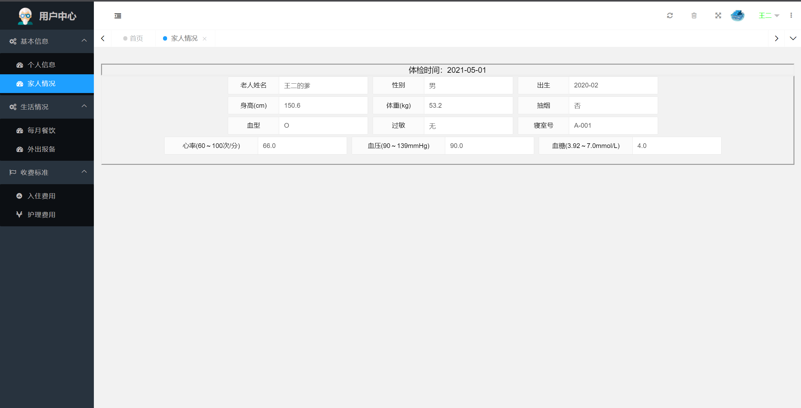
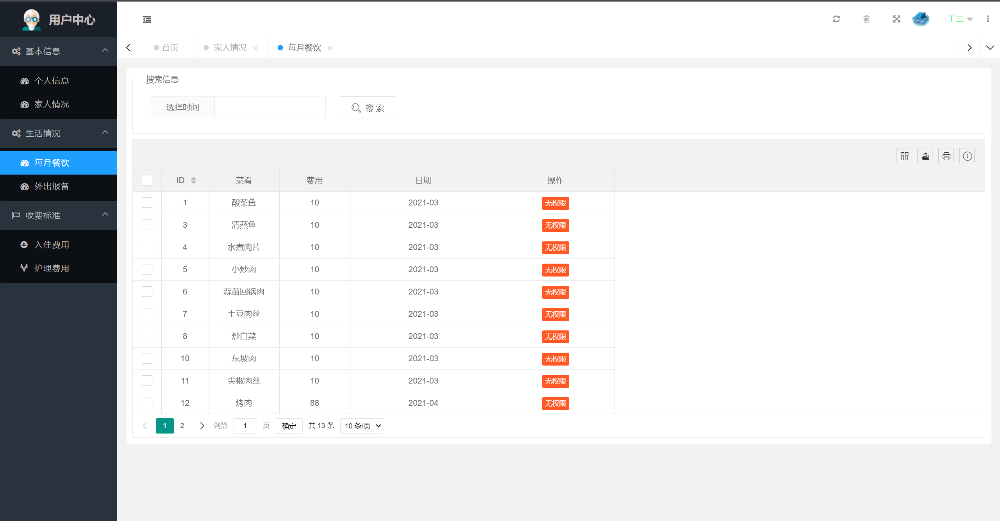
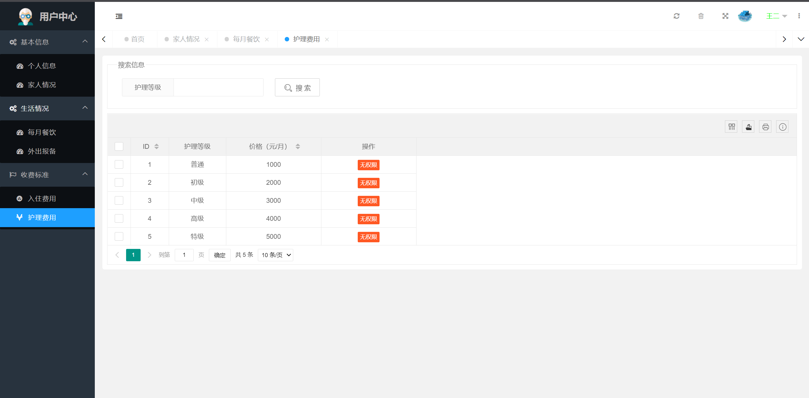

基于Springboot框架实现的养老院信息管理系统
=
###  完整代码获取地址：从戎源码网 ([https://armycodes.com/](https://armycodes.com/))
###  作者微信：19941326836  QQ：952045282 
###  承接计算机毕业设计、Java毕业设计、Python毕业设计、深度学习、机器学习
###  选题+开题报告+任务书+程序定制+安装调试+论文+答辩ppt 一条龙服务
###  毕业设计所有选题地址:(https://github.com/3212618475/allProject)

一、项目介绍
---
基于SpringBoot框架的养老院信息管理系统，有用户、管理员、超级管理员3个角色，主要功能如下
### 【用户】
基本信息：个人信息、家庭情况
生活情况：每月餐饮、外出报备
收费标准：入住费用、护理费用

### 【管理员】
账号管理：管理员账号、用户账号
健康管理：健康档案、病例档案、药品管理
生活管理：每月餐饮、外出报备
入住管理：入驻登记、寝室分配
安全管理：事故记录、访客记录
收费标准：入住费用、护理费用

### 【超级管理员】
具有所有功能权限

二、项目技术
---
编程语言：Java
数据库：MySQL
项目管理工具：Maven
前端技术：Vue
后端技术：SpringBoot

三、运行环境
---
操作系统：Windows、macOS都可以
JDK版本：JDK1.8以上都可以
开发工具：IDEA、Ecplise、Myecplise都可以
数据库: MySQL5.7以上都可以
Tomcat：任意版本都可以
Maven：任意版本都可以

四、项目截图
---
文档截图

使用截图

